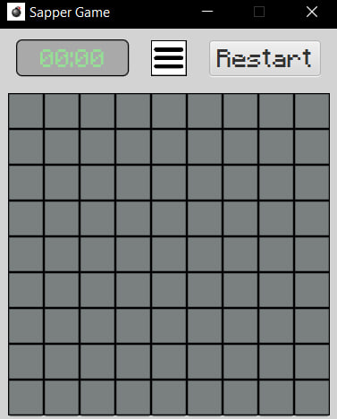

# Minesweeper Game
**Version:** 1.0

## Game Description
Minesweeper is a classic logic-based computer game where the player must uncover all cells on a grid without hitting any mines. This project is a Java implementation of the game using JavaFX for the graphical interface.

This is an independent educational project developed to learn:
- Working with JavaFX and UI creation
- Event handling and user input processing
- Game logic and algorithms
- Debugging and error fixing

## Interface Screenshots

  
*Main game menu*

  
*Game field*

  
*Difficulty level selection menu*

  
*Victory screen*

  
*Game over screen*

## Class Table
In order not to clutter it up,
I moved it [here](./ListOfClasses.md).

## Implementation Features

1. **Three difficulty levels**:
    - Easy (9x9, max 30 mines)
    - Medium (16x16, max 80 mines)
    - Hard (16x30, max 180 mines)

2. **Intuitive interface**:
    - Left click - reveal cell
    - Right click - place/remove flag

3. **Additional features**:
    - Game timer
    - Restart button
    - Return to main menu option

## Acquired Skills

During this project's development I gained the following skills:
1. **UI Development**:
    - Creating interfaces with JavaFX
    - Working with buttons, labels, images
    - Layout organization

2. **Event Handling**:
    - Implementing mouse click handlers
    - Managing game state based on user actions
    - Synchronizing interface components

3. **Debugging**:
    - Identifying and fixing logical errors
    - Performance optimization
    - Testing various game scenarios

4. **Application Architecture**:
    - Separation of logic and presentation
    - Creating modular structure
    - Application state management

## Future opportunities
The project will continue to evolve with more Minecraft-themed features:
- Addition of Minecraft block textures
- Themed sound effects and background music
- Minecraft-style UI improvements
- File handling (saving best scores/last game)
- Creating an executable (.exe) file
- Separating all styles into a CSS file
- Making the project structure more modular
- Implementing different access levels

## Conclusion

This project provided excellent practice for applying Java knowledge. Particularly valuable was the experience with event handling and creating interactive interfaces. Developing Minesweeper helped deepen my understanding of object-oriented programming principles and the importance of clear application architecture.

